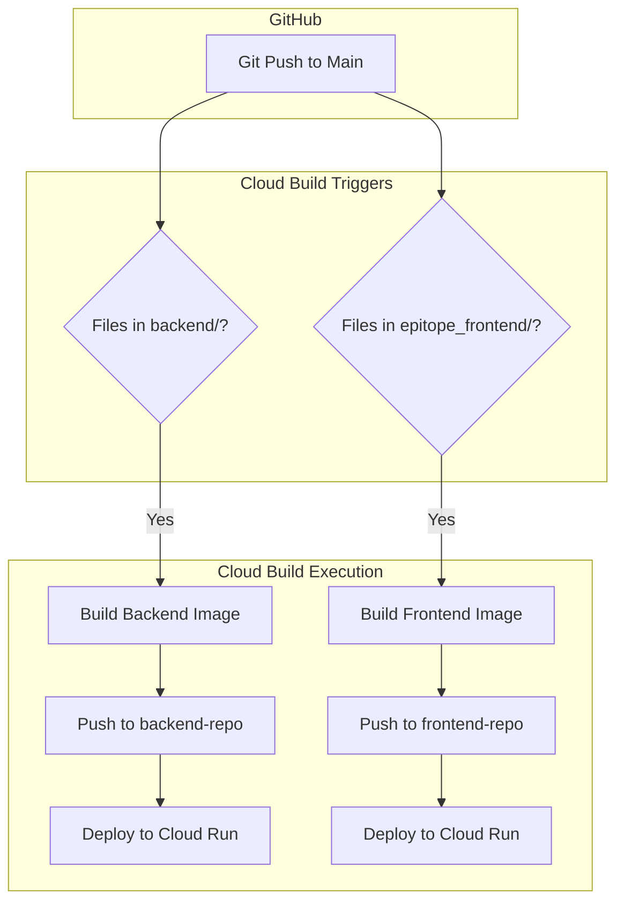

# Google Cloud Deployment Specification for Epitope Finder

This document outlines the improved CI/CD workflow for the Epitope Finder monorepo, utilizing Google Cloud Artifact Registry and Cloud Build.

## 1. Artifact Registry Structure

To improve organization and management, we will use separate Docker repositories for the backend and frontend.

### Repositories
- **Location:** `us-west1` (Recommended, or your preferred region)
- **Backend Repository:** `backend-repo`
- **Frontend Repository:** `frontend-repo`

### Image Naming Convention
Images will be tagged with the short Git SHA to ensure traceability and avoid "random" naming issues.
- `us-west1-docker.pkg.dev/[PROJECT_ID]/backend-repo/backend:[SHORT_SHA]`
- `us-west1-docker.pkg.dev/[PROJECT_ID]/frontend-repo/frontend:[SHORT_SHA]`
- The `latest` tag will also be updated on every successful build.

---

## 2. Artifact Registry Cleanup Policies

To prevent storage bloat and manage costs, the following cleanup policies should be applied to both repositories.

### Recommended Policy: "Keep Recent & Delete Old"
Create a file named `policy.json` and apply it using `gcloud artifacts repositories set-cleanup-policies`.

```json
[
  {
    "name": "keep-last-5",
    "action": { "type": "Keep" },
    "mostRecentVersions": {
      "keepCount": 5
    }
  },
  {
    "name": "delete-older-than-30-days",
    "action": { "type": "Delete" },
    "condition": {
      "olderThan": "2592000s"
    }
  }
]
```

**How to apply:**
```bash
gcloud artifacts repositories set-cleanup-policies backend-repo \
    --project=[PROJECT_ID] \
    --location=us-west1 \
    --policy=policy.json
```

---

## 3. Cloud Build Monorepo Strategy

We will use a single [`cloudbuild.yaml`](cloudbuild.yaml) file in the root directory. This file uses user-defined substitutions to decide which service to build.

### Trigger Configuration (Critical for Monorepo)

To ensure that backend changes don't trigger frontend builds (and vice versa), you must set up **two separate triggers** in the Google Cloud Console.

#### Trigger 1: Backend Deployment
- **Event:** Push to branch (e.g., `main`)
- **Included files filter:** `backend/**`
- **Configuration file:** `cloudbuild.yaml`
- **Substitution variables:**
  - `_SERVICE_NAME`: `backend`
  - `_DIR`: `backend`
  - `_REPO`: `backend-repo`

#### Trigger 2: Frontend Deployment
- **Event:** Push to branch (e.g., `main`)
- **Included files filter:** `epitope_frontend/**`
- **Configuration file:** `cloudbuild.yaml`
- **Substitution variables:**
  - `_SERVICE_NAME`: `epitope-frontend`
  - `_DIR`: `epitope_frontend`
  - `_REPO`: `frontend-repo`

### Workflow Diagram



---

## 4. Implementation Steps

1. **Create Repositories:**
   ```bash
   gcloud artifacts repositories create backend-repo --repository-format=docker --location=us-west1
   gcloud artifacts repositories create frontend-repo --repository-format=docker --location=us-west1
   ```
2. **Apply Cleanup Policies:** (See section 2)
3. **Add `cloudbuild.yaml` to root:** (Created in this task)
4. **Create Triggers in GCP Console:** (Follow instructions in section 3)
